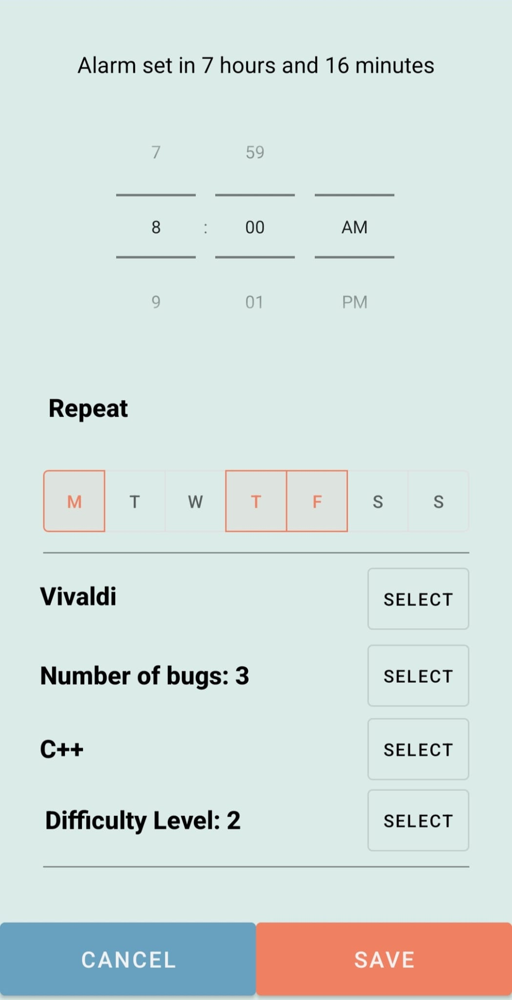

# Buggy-Alarm 

## Android Studio Project - An alarm that helps you test your programming knowledge

👩🏻‍💻 **Team Members:**
- [Lungu Laura-Vanesa, UB](https://github.com/LVanesa)
- [Negoiță-Crețu Raluca-Marina, UB](https://github.com/ncraluca)
- [Popa Jasmine-Mihaela, group, UB](https://github.com/jasminepopa3)

---

:tv: **[Demo Here](https://youtu.be/J4AgXN1D-Ps)**

---

    
    
    
    

---

⏰ **Epic story:** 
We aim to create a mobile application that functions as an alarm clock but with a twist for programming enthusiasts. Users will have to solve programming challenges to turn off the alarm, testing their skills in various programming languages.

---

🖥️ **Tech Stack:** 
Android Studio IDE (Java) + Firebase (Database)

---

📋 **User Stories:**

✅ 1. As a user of the application, I want to be able to set an alarm for a specific time and date.      
✅ 2. As a user of the application, I want to be able to set a recurring alarm (daily/weekly/monthly, etc.).     
✅ 3. As a user of the application, I want to set a specific number of bugs to solve to turn off the alarm.     
✅ 4. As a user of the application, I want to be able to choose the alarm tone from a list.    
✅ 5. As a user of the application, I want to be able to choose the programming language in which bugs will be generated.     
✅ 6. As a programmer, I want to train my reaction speed and observation skills by solving bugs even when I'm just waking up.     
✅ 7. As an IT enthusiast, I want to periodically practice my programming knowledge.     
✅ 8. As a user of the application, I want to choose the difficulty level of the bugs.     
✅ 9. As an aspiring IT professional, I want to see the solving time for each bug in an alarm.      
✅ 10. As an aspiring IT professional, I want to see the average solving time for bugs in an alarm.    

---

:bar_chart: **Workflow Diagram**

---
📌 **Backlog:**

- [x] Set up a repository on Github.
- [x] Create a simple alarm application.
- [x] Define the structure of a database for the application.
- [x] Connect the application to the database.
- [x] Develop programming challenges for the application.
- [x] Create a quiz based on the questions stored in the database.
- [x] Design the application's interface (+ workflow diagram, prototyping in Figma).
- [x] Implement the integration of ringtones into the application.
- [x] Integrate the option to select the programming language.
- [x] Integrate the option to select the number of bugs.
- [x] Integrate the option to select the difficulty level.

